<center><h1> Nerdvana Pegasus 2023 </center>

## Table of Contents
* [Photos](#team-image)
  * [Team](#team-image)
  * [Robot](#robot-image)
* [Performance Video](#video)
* [Mobility Management](#mobility-management)
  * [Powertrain](#powertrain-mechanical)
    * [Motor](#motor-mechanical)
  * [Steering](#steering-mechanical)
    * [Steering Mechanism](#steering-mechanism)
    * [Steering Motor](#steering-motor)
* [Power and Sense Management](#power-and-sense-management)
  * [Battery](#mindstorm-battery)
  * [Inventor Hub](#inventor-hub)
  * [Distance Sensor](#distance-sensor)
  * [Camera Adapter](#camera-adapter)
  * [Camera](#camera)
* [Circuit Diagram](#circuit-diagram)
* [Code for each component](#code-for-each-component)
  * [Drive Motor](#drive-motor-code)
  * [Steering Motor](#steering-motor-code)
  * [Distance Sensor](#distance-sensor-code)
  * [Camera](#camera-code)
* [Obstacle Management](#obstacle-management)
  * [Qualification Round](#quali-management)
  * [Final Round](#final-management)
* [Randomizer](#randomizer)
* [Resources](#resources)
  * [Images](#images-resources)

### Team: Catana Radu Nicolae si Coman Andrei<a class="anchor" id="team-image"></a>

## Photos of our robot <b>TBD<b> <a class="anchor" id="robot-image"></a>

| 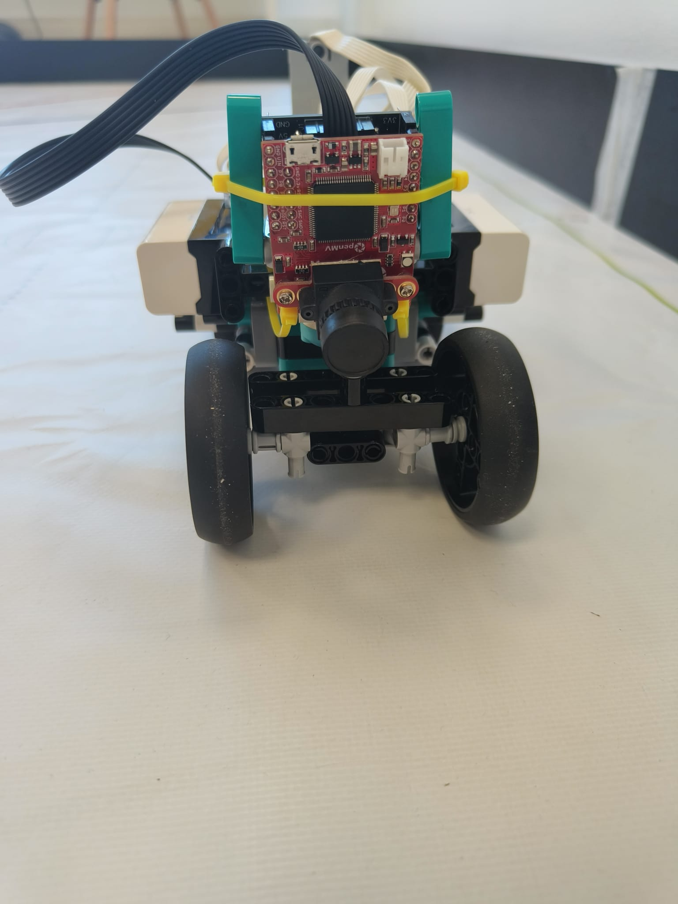 | 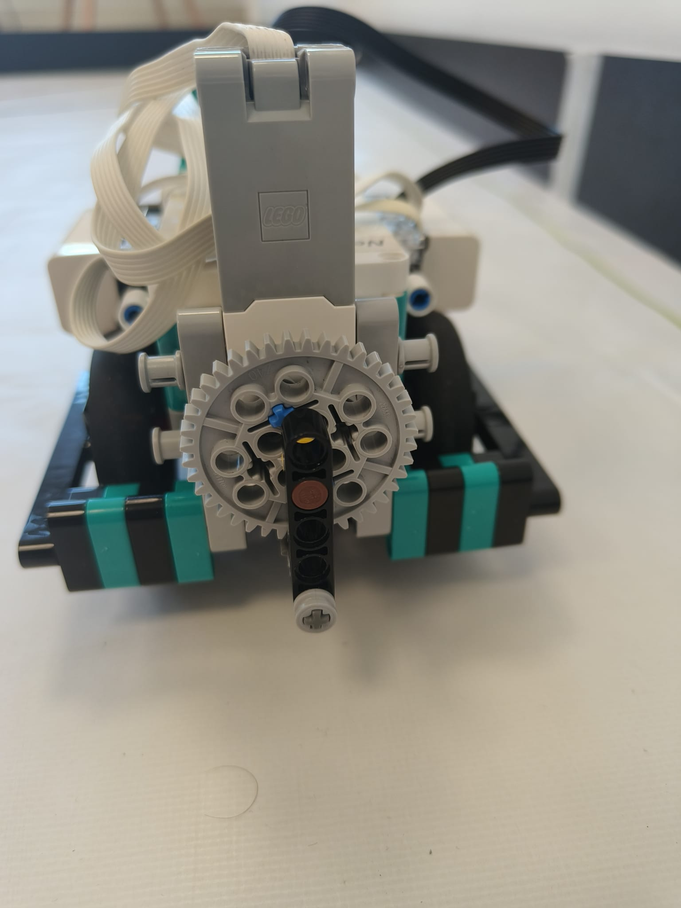 | 
| :--: | :--: | 
| *Front* | *Back* |
| 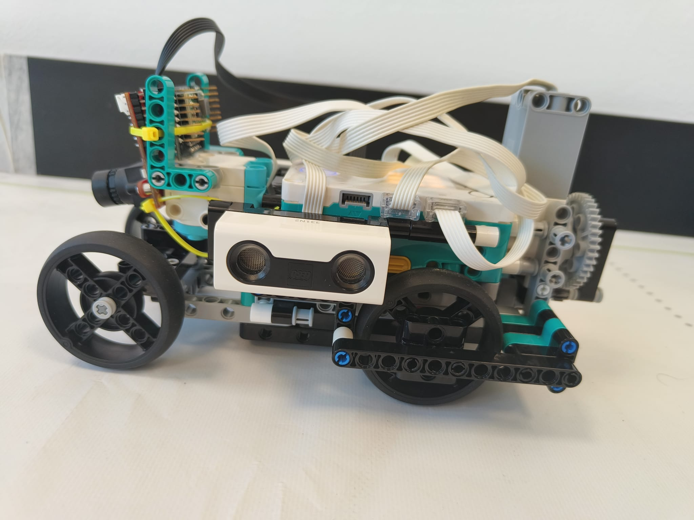 | 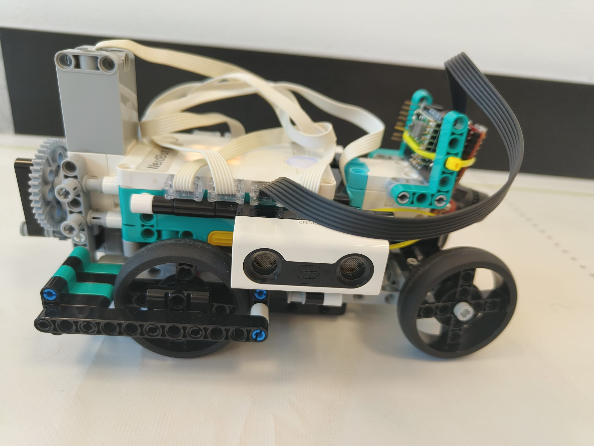 | 
| *Left* | *Right* |
| 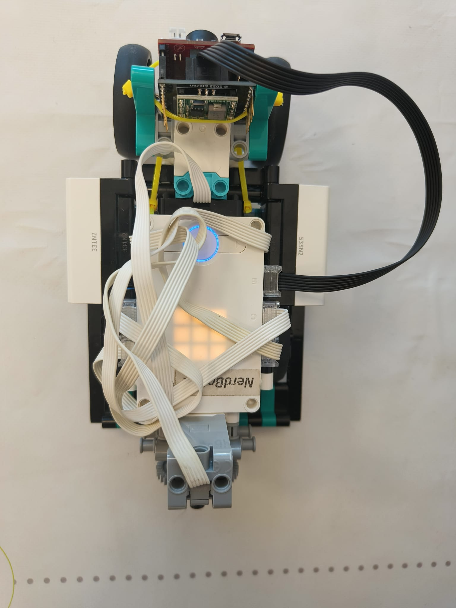 | 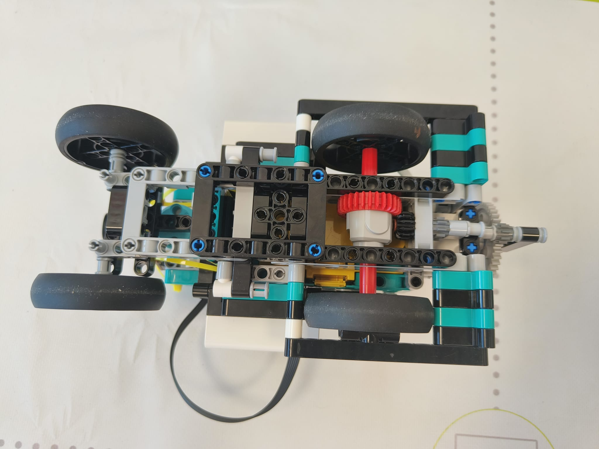 | 
| *Top* | *Bottom* |

<br>

# Mobility Management <a class="anchor" id="mobility-management"></a>

## PowerTrain <a class="anchor" id="powertrain-mechanical"></a>


### Motor <a class="anchor" id="motor-mechanical"></a>

Following an evaluation of different motors, we settled on a LEGO Tehnic Medium Angular Motor that on which we attached a gear. This motor was chosen for its lower-load, fast-response applications, so we can make evaluations faster. Also, it's a simple form factor for building because it can be easily connected to other components.

**Specifications:**
- Voltage: 5V-9V
- Speed: 135RPM ± 15%
- Torque: 3.5 ± Ncm
- Weight: 54g

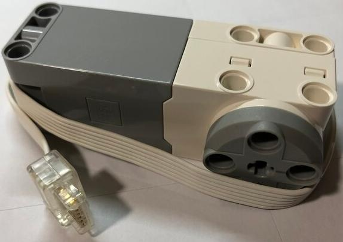

Where to buy the drive motor: https://raisingrobots.com/product/lego-technic-medium-angular-motor/

As I mentioned, a gear connected to the motor drives a series of gears located at the base of the robot. When the gears are properly aligned, this setup ensures that both wheels rotate in the same direction. Below is the explaination of the rack:

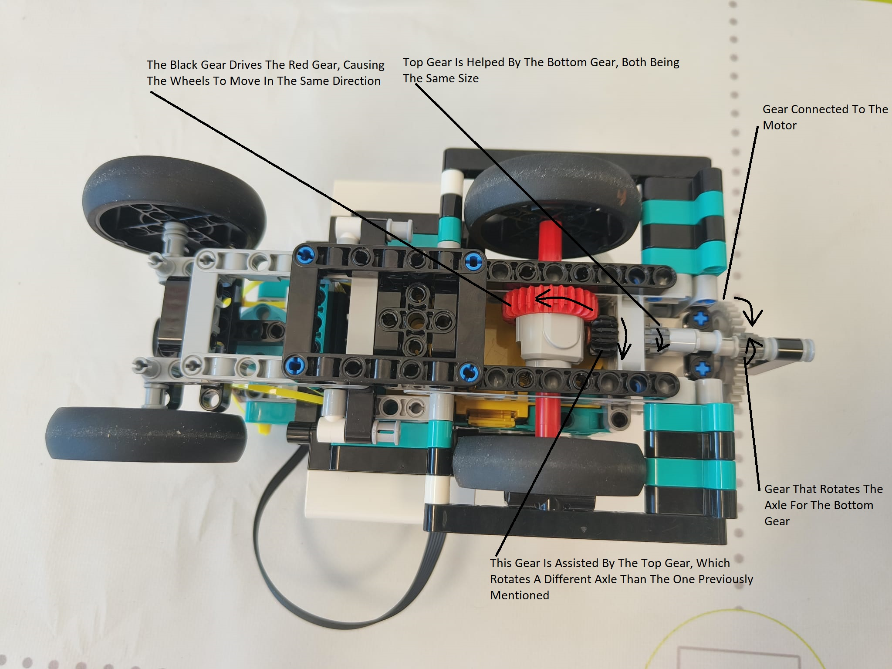

## Steering <a class="anchor" id="steering-mechanical"></a>

### Steering Mechanism <a class="anchor" id="steering-mechanism"></a>

We reviewed several steering systems and decided that this one would be the best optimized for our circuit. This system is designed as a parallelogram, making it simple and easy to handle, allowing for smooth turns at a satisfactory angle.

### Steering Motor <a class="anchor" id="steering-motor"></a>

For steering, we selected the LEGO Tehnic Small Angular Motor, favoring it for its high torque and swift response.

**Specifications:**
- Voltage: 3.3V-6V
- Speed: 85RPM ± 15%
- Torque: 1.8 ± Ncm
- Weight: 32g
- Rotation Angle: 360 degrees

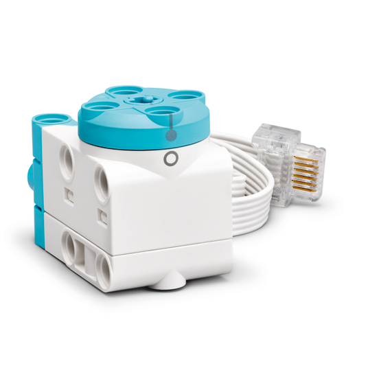

Where to buy the steering motor: https://raisingrobots.com/product/lego-technic-small-angular-motor/

To connect the Spike motor to the steering system, we used a bar of lego.

# Power and Sense Management <a class="anchor" id="power-and-sense-management"></a>

### Recharchable Mindstorm Battery <a class="anchor" id="mindstorm-battery"></a>

We chose this battery because of the Inventor Hub, which is a key component of our robot. This battery is the same type used in the Spike system, which is why its specifications are only available under the Spike model. It has a capacity of 7.3V and 2100mAh, with a weight of 110g. We selected it to make the robot lighter and to take advantage of its quick charging capability.

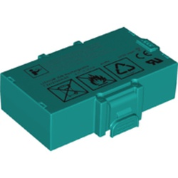

Where to buy the battery: https://rebrickable.com/parts/67704/battery-pack-rechargeable-mindstorms-robot-inventor/3/

### Inventor Hub <a class="anchor" id="inventor-hub"></a>

This component is crucial for our robot because it allows us to use the hub's gyroscope to maintain a straighter path. We've implemented PID control on the Gyro to minimize errors in the wall-following system, thereby reducing the chances of the robot touching the track walls.Additionally, all the motors and sensors are connected to it, giving us complete control over every component. We also used the button lights for debugging to indicate whether we're using PID on the Gyro or on the two walls between which the robot is positioned.

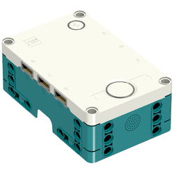

Where to buy the Inventor Hub: https://rebrickable.com/parts/67718/hub-programmable-mindstorms-robot-inventor/#buy_parts

### Distance Sensor <a class="anchor" id="distance-sensor"></a>

We used distance sensors for their precision when the robot is positioned between two walls, allowing us to adjust it to stay exactly in the center of the corridor. This is beneficial in both challenges, as the front camera will remain centered, enabling it to detect blocks more quickly and easily.

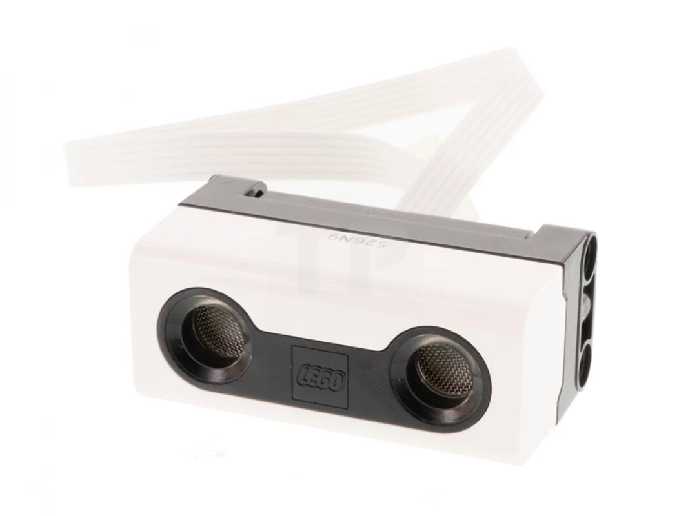

Where to buy the LEGO Tehnic Distance Sensor: https://education.lego.com/en-us/products/lego-technic-distance-sensor/45604/

### Camera Adapter <a class="anchor" id="camera-adapter"></a>

We selected this breakout board for the robot’s front camera because it ensures durability and consistent performance. Additionally, it’s equipped with a 5V buck converter, providing high-power performance and enabling the creation of complex LED displays.

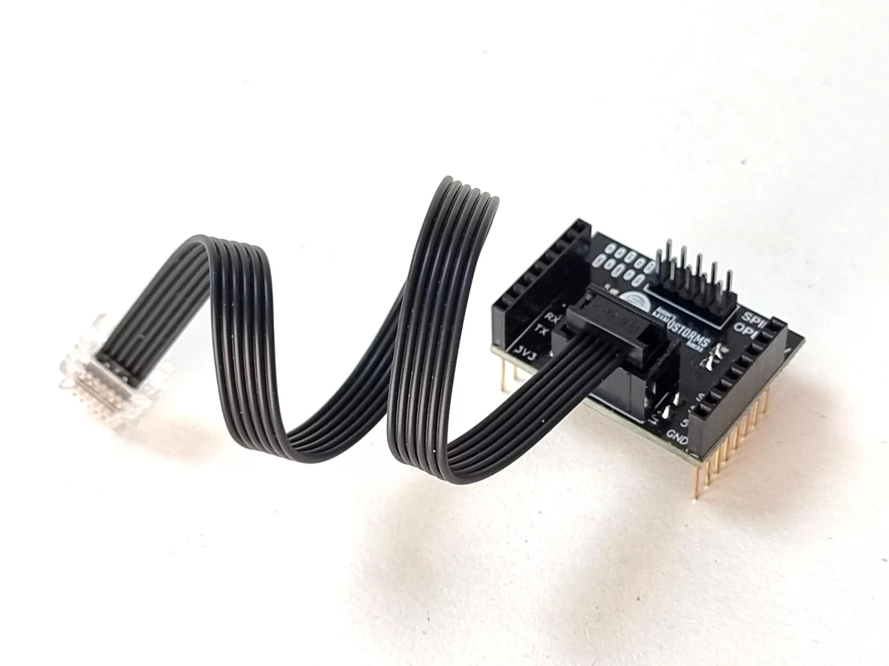

Where to buy the SPIKE Smart Camera Breakout Board: https://www.antonsmindstorms.com/product/spike-smart-camera-breakout-board-spike-openmv/

### Camera <a class="anchor" id="camera"></a>

We chose to use the OpenMV Cam H7 R2 because of its high performance in color recognition. A key advantage of this camera is its microcontroller, which quickly transmits images using Python, making it easy to implement.

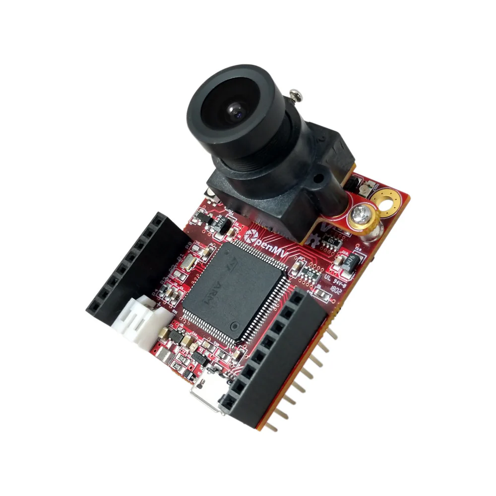

Where to buy the OpenMV Cam H7 R2: https://openmv.io/products/openmv-cam-h7-r2

# Circuit diagram <a class="anchor" id="circuit-diagram"></a>
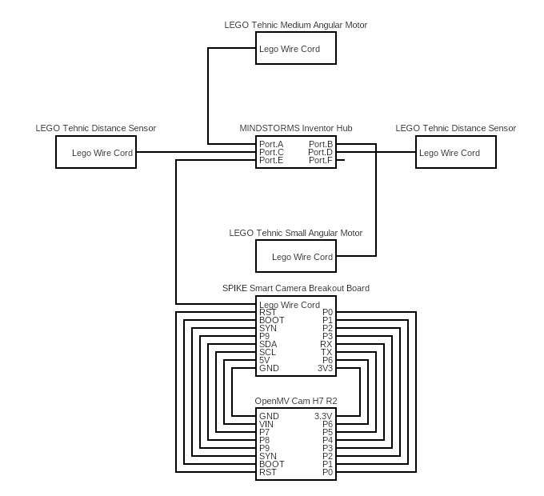

<br>

# Code for each component <a class="anchor" id="code-for-each-component"></a>

## Drive Motor <a class="anchor" id="drive-motor-code"></a>

The LEGO Technic Medium Angular Motor can be controlled using the Pybricks library, allowing us to set the robot’s speed. Additionally, we can easily calculate the distance the robot has traveled by using a function that returns the motor’s rotation angle, which can be reset whenever needed.

Below are the functions that we used in the code for the drive motor: TBD

```py
drivingMotor.run(DrivingSpeed)
drivingMotor.brake()
drivingMotor.reset_angle(0)
```

## Steering Motor <a class="anchor" id="steering-motor-code"></a>


First, to optimize the robot’s turning efficiency, we determined the servo limits by rotating the motor fully to the left and right, using the angle-reading function from the pybricks.pupdevices import Motor library. Additionally, we used the stopwatch tools from the pybricks.tools import StopWatch library to precisely control the timing for how long the motor should turn in each direction.

```py
def FindServoLimits():
    global ServoCheckTime
    ServoCheckTime = 1000
    
    stopWatch.pause()
    stopWatch.reset()
    stopWatch.resume()
    global MinAngleLimit
    MinAngleLimit = steeringMotor.angle()
    while stopWatch.time()<ServoCheckTime:
        steeringMotor.run(-500)
        if MinAngleLimit > steeringMotor.angle():
            MinAngleLimit = steeringMotor.angle()
    stopWatch.pause()
    stopWatch.reset()
    stopWatch.resume()
    global MaxAngleLimit
    MaxAngleLimit = steeringMotor.angle()
    while stopWatch.time()<ServoCheckTime:
        steeringMotor.run(500)
        if MaxAngleLimit < steeringMotor.angle():
            MaxAngleLimit = steeringMotor.angle()
    global MiddleAngle
    MiddleAngle = (MinAngleLimit+MaxAngleLimit)/2
    stopWatch.pause()
    stopWatch.reset()
    stopWatch.resume()
    while stopWatch.time()<ServoCheckTime:
        steeringMotor.track_target(MiddleAngle)
    steeringMotor.reset_angle(steeringMotor.angle()-MiddleAngle)
    MinAngleLimit -= MiddleAngle
    MaxAngleLimit -= MiddleAngle
    MiddleAngle = 0
```

We conducted several tests to make the robot turn left or right without hitting the walls of the course. Based on our trials, we decided that the robot should turn along a circular radius that it determines as soon as it detects the need to turn. This idea came to us after performing mathematical calculations, leading us to conclude that this approach would enable the robot to make turns as quickly as possible, thereby reducing the time it takes to complete a lap.

To ensure the robot makes its turns at the desired angle as accurately as possible, we decided to use a PID (Proportional–Integral–Derivative) controller to adjust the steering motor's power based on the calculated angle. We set the I constant to 0 because it didn't seem to affect the program. To execute the rotation, we reduced the driving motor's speed to half of its usual value, allowing the robot to complete the maneuver more efficiently. After completing the turn, we update the robot with a new gyro offset.

```py
global GyroOffSet, SteeringKP, SteeringKD
GyroOffSet = 0
def TurnLeft():
    global GyroOffSet, SteeringDeg, SteeringKP, SteeringKD
    SteeringDeg = -SteeringDeg #This variable is calculated below, where the code for the qualification round is explained.
    SteeringErr = 0
    LastSteeringErr = 0
    while GetActualHeading() > -75:
        drivingMotor.run(DrivingSpeed/2)
        SteeringErr = SteeringDeg-steeringMotor.angle()
        steeringMotor.dc(SteeringErr*SteeringKP+(SteeringErr-LastSteeringErr)*SteeringKD)
        LastSteeringErr = SteeringErr

    GyroOffSet += 90

def TurnRight():
    global GyroOffSet, SteeringDeg, SteeringKP, SteeringKD
    SteeringErr = 0
    LastSteeringErr = 0
    while GetActualHeading() < 75:
        drivingMotor.run(DrivingSpeed/2)
        SteeringErr = SteeringDeg-steeringMotor.angle()
        steeringMotor.dc(SteeringErr*SteeringKP+(SteeringErr-LastSteeringErr)*SteeringKD)
        LastSteeringErr = SteeringErr

    GyroOffSet -= 90
```

## Distance Sensor <a class="anchor" id="distance-sensor-code"></a>

To calculate the distance between the walls and the robot’s sensors, we had to use a mathematical formula because, if the robot was misaligned, the function from the pybricks.pupdevices import UltrasonicSensor library would return inaccurate readings. Therefore, we applied trigonometry by multiplying the result by the cosine of the robot’s angle. For this, we used the umath import fabs, radians, cos library.

After determining the distance between the robot and the walls more accurately, we realized it would be helpful to transform the corridor where the robot is located into a range where the inner wall is at -100 and the outer wall at +100. This way, we can calculate the exact percentage of the robot's position between the two walls. By transforming the corridor into a specified range, we can control the robot's movement more precisely, allowing us to choose a specific path for it to follow throughout the test, which should make the process faster and more efficient.

```py
def MapTwoIntervals(intA, val, intB, intC, intD):
    mappedval = intC + (val-intA)/(intB-intA)*(intD-intC)
    return mappedval

global DistBetweenUltraSonics
DistBetweenUltraSonics = 120
def CalculateSideSensorProcentage():
    Degrees = GetActualHeading()
    Degrees = fabs(Degrees)
    global RawDistST
    global RawDistDR
    RawDistST = ultrasonicSensorST.distance()
    RawDistDR = ultrasonicSensorDR.distance()
    global ProcentageDiff
    global DistST
    global DistDR
    global DistBetweenUltraSonics
    if RawDistST!=2000 and RawDistDR!=2000: #In this case, it still detects both walls at a relatively similar distance.
        Radians = radians(Degrees)
        DistST = RawDistST * cos(Radians)
        DistDR = RawDistDR * cos(Radians)
        Sum = DistST+DistBetweenUltraSonics+DistDR
        Diff = DistST-DistDR
        ProcentageDiff = MapTwoIntervals(-Sum, Diff, Sum, -100, 100)
    else:
        DistST = -1
        DistDR = -1
        ProcentageDiff = -210
```

## Camera <a class="anchor" id="camera-code"></a>

Now that we’ve successfully implemented the functions for the driving and steering motors, we need to enable the robot to detect the cubes it needs to avoid. To communicate with the Inventor Hub, we used the UART protocol.

Inventor Hub code:

```py

```

Camera code:

```py
import pyb
from pyb import UART
from pupremote import PUPRemoteSensor, OPENMV
# UART 3 and baudrate
uart = UART(3, 115200)
# power=True is needed for OpenMV RT. H7 can go without power
p=PUPRemoteSensor(power=True)
# Define a data channel to read on the hub
p.add_channel('blob', to_hub_fmt='hhhhh')
```

# Obstacle Management <a class="anchor" id="obstacle-management"></a>

## Qualification Round <a class="anchor" id="quali-management"></a>

## Final Round <a class="anchor" id="final-management"></a>

For the final round resolution, we adopted a three-tiered modular approach to achieve greater precision and fluidity. The first module is designed for navigating through the current section, the second for detecting and evading any immediate cubes, and the third for executing rotations and setting up for the following section.

The initial segment serves as the core switch-case structure within our code, where we continuously monitor for any cubes to avoid or for cues to initiate a rotation in preparation for the upcoming section. Should neither of these conditions arise, the robot is programmed to maintain a direct trajectory through the segment, ensuring uninterrupted progress.

```ino
case SECTION: {
  if(turn_ok && wall_dist[FRONT] && wall_dist[FRONT] < 700  && millis() - last_rotate > rotate_timeout) {
    turns++;
    last_rotate = millis();
    last_cube_color = 0;
    last_dist_to_cube = 0;
    flag = 0;
    cube_section_cnt = 0;
    if (wall_dist[side_wall] > 550)
      CASE = ROTATE;
    else
      current_angle += direction * 90;   
  } else if (last_dist_to_cube && cube_color != last_cube_color && cube_color != 0 && wall_dist[BACK] < 1800) {
    move_servo(cube_color * 1);

    if (cube_color == GREEN) {
      if(direction == 1)
        goal_distance = 250 + (wall_dist[side_wall] - 230) / 6;
      else
        goal_distance = 850 - (1000 - wall_dist[side_wall]) / 6;
    } else {
      if(direction == 1)
        goal_distance = 770 - (1000 - wall_dist[side_wall]) / 5;
      else
        goal_distance = 270 + (wall_dist[side_wall] - 200) / 5;
    }

    last_cube_color = cube_color;
    cube_section_cnt++;

    if(turns == 3) {
      final_cube_color = last_cube_color;
      final_cube_pos = cube_section_cnt;
      final_cube_turn = turns;
    } 
    if(turns == 4) {
      if(last_cube_y < 1700) {
        final_cube_color = last_cube_color;
        final_cube_pos = cube_section_cnt;
        final_cube_turn = turns;
      }
    }
    
    CASE = AVOID_CUBE;
  } else {

    if(millis() - last_turn_ok > rotate_timeout && (wall_dist[BACK] > 1850 || (wall_dist[LEFT] + wall_dist[RIGHT]) > 1200) && !turn_ok) {
      turn_ok = 1;
      last_turn_ok = millis();
    }
    pid_error_gyro = ((current_angle) - gx) * kp_gyro + (pid_error_gyro - pid_last_error_gyro) * kd_gyro;
    pid_last_error_gyro = pid_error_gyro;

    move_servo(pid_error_gyro);
  }
  break;
}
```

# Randomizer <a class="anchor" id="randomizer"></a>

To ensure the robot's ability to adapt to any course, we developed a randomizer that generates a random sequence of colors and positions for the cubes. You can find this web application at the following link: https://nerdvana.ro/wro-fe/

<br>

# Resources <a class="anchor" id="resources"></a>

## Images <a class="anchor" id="images-resources"></a>
<li> LEGO Tehnic Medium Angular Motor - https://img.bricklink.com/ItemImage/PN/86/54696c01.png
<li> LEGO Tehnic Small Angular Motor - https://i.sstatic.net/th7N7.png
<li> Recharchable Battery - https://cdn.rebrickable.com/media/thumbs/parts/elements/6299315.jpg/250x250p.jpg
<li> Inventor Hub - https://cdn.rebrickable.com/media/thumbs/parts/ldraw/3/67718.png/250x250p.png
<li> LEGO Tehnic Distance Sensor - https://cdn.toypro.com/media/cache/tp_product_detail/uploads/images/custom/43694-src.webp
<li> SPIKE Smart Camera Breakout Board - https://www.antonsmindstorms.com/wp-content/uploads/2023/08/20230817_121845-scaled-jpg.webp
<li> OpenMV Cam H7 R2 - https://openmv.io/cdn/shop/files/clean1080_a857bc07-b943-445d-9f7c-27d506a3a0dd_1000x_crop_center.jpg


<br>

## Copyright <a class="anchor" id="copyright"></a>

Unless explicitly stated otherwise, all rights, including copyright, in the content of these files and images are owned or controlled for these purposes by Nerdvana Romania.

You may copy, download, store (in any medium), adapt, or modify the content of these Nerdvana Romania resources, provided that you properly attribute the work to Nerdvana Romania.

For any other use of Nerdvana Romania's content, please get in touch with us at office@nerdvana.ro.

© 2023 Nerdvana Romania. All rights reserved.
