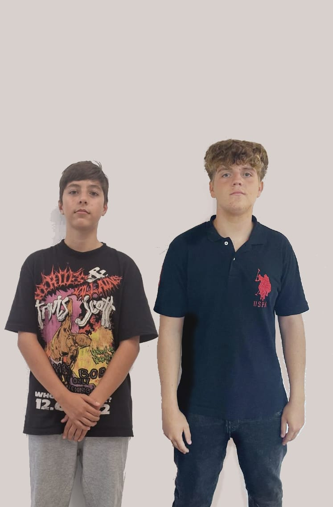

<center><h1> Nerdvana Pegasus 2024 </center>

## Table of Contents
* [Photos](#team-image)
  * [Team](#team-image)
  * [Robot](#robot-image)
* [Performance Video](#video)
* [Mobility Management](#mobility-management)
  * [Powertrain](#powertrain-mechanical)
    * [Drive Motor](#drive-motor-mechanical)
  * [Steering](#steering-mechanical)
    * [Steering Mechanism](#steering-mechanism)
    * [Steering Motor](#steering-motor)
* [Power and Sense Management](#power-and-sense-management)
  * [Battery](#mindstorm-battery)
  * [Inventor Hub](#inventor-hub)
  * [Distance Sensor](#distance-sensor)
  * [Camera Adapter](#camera-adapter)
  * [Camera](#camera)
* [Circuit Diagram](#circuit-diagram)
* [Code for each component](#code-for-each-component)
  * [Drive Motor](#drive-motor-code)
  * [Inventor Hub](#inventor-hub-code)
  * [Steering Motor](#steering-motor-code)
  * [Distance Sensor](#distance-sensor-code)
  * [Camera](#camera-code)
* [Obstacle Management](#obstacle-management)
  * [Qualification Round](#quali-management)
  * [Final Round](#final-management)
* [Randomizer](#randomizer)
* [Resources](#resources)
  * [Images](#images-resources)

### Team: Catana Radu Nicolae and Coman Andrei<a class="anchor" id="team-image"></a>


## Photos of our robot <a class="anchor" id="robot-image"></a>

|  |  | 
| :--: | :--: | 
| *Front* | *Back* |
|  |  | 
| *Left* | *Right* |
|  |  | 
| *Top* | *Bottom* |

<br>


## Our video of the robot on [Youtube](https://youtu.be/OukqeuoSe7s) <a class="anchor" id="video"></a>


<br>

# Mobility Management <a class="anchor" id="mobility-management"></a>

## PowerTrain <a class="anchor" id="powertrain-mechanical"></a>


### Drive Motor <a class="anchor" id="drive-motor-mechanical"></a>

Following an evaluation of different motors, we settled on a LEGO Tehnic Medium Angular Motor that on which we attached a gear. This motor was chosen for its lower-load, fast-response applications, so we can make evaluations faster. Also, it's a simple form factor for building because it can be easily connected to other components.

**Specifications:**
- Voltage: 5V-9V
- Speed: 135RPM ± 15%
- Torque: 3.5 ± Ncm
- Weight: 54g


Where to buy the drive motor: https://raisingrobots.com/product/lego-technic-medium-angular-motor/

As I mentioned, a gear connected to the motor drives a series of gears located at the base of the robot. When the gears are properly aligned, this setup ensures that both wheels rotate in the same direction. Below is the explaination of the rack when the motor rotates counter clockwise:


## Steering <a class="anchor" id="steering-mechanical"></a>

### Steering Mechanism <a class="anchor" id="steering-mechanism"></a>

We reviewed several steering systems and decided that this one would be the best optimized for our circuit. This system is designed as a parallelogram, making it simple and easy to handle, allowing for smooth turns at a satisfactory angle.

### Steering Motor <a class="anchor" id="steering-motor"></a>

For steering, we selected the LEGO Tehnic Small Angular Motor, favoring it for its high torque and swift response.

**Specifications:**
- Voltage: 3.3V-6V
- Speed: 85RPM ± 15%
- Torque: 1.8 ± Ncm
- Weight: 32g
- Rotation Angle: 360 degrees


Where to buy the steering motor: https://raisingrobots.com/product/lego-technic-small-angular-motor/

To connect the Spike motor to the steering system, we used a bar of lego.

# Power and Sense Management <a class="anchor" id="power-and-sense-management"></a>

### Recharchable Mindstorm Battery <a class="anchor" id="mindstorm-battery"></a>

We chose this battery because of the Inventor Hub, which is a key component of our robot. This battery is the same type used in the Spike system, which is why its specifications are only available under the Spike model. It has a capacity of 7.3V and 2100mAh, with a weight of 110g. We selected it to make the robot lighter and to take advantage of its quick charging capability.


Where to buy the battery: https://rebrickable.com/parts/67704/battery-pack-rechargeable-mindstorms-robot-inventor/3/

### Inventor Hub <a class="anchor" id="inventor-hub"></a>

This component is crucial for our robot because it allows us to use the hub's gyroscope to maintain a straighter path. We've implemented PID control on the Gyro to minimize errors in the wall-following system, thereby reducing the chances of the robot touching the track walls.Additionally, all the motors and sensors are connected to it, giving us complete control over every component. We also used the button lights for debugging to indicate whether we're using PID on the Gyro or on the two walls between which the robot is positioned.


Where to buy the Inventor Hub: https://rebrickable.com/parts/67718/hub-programmable-mindstorms-robot-inventor/#buy_parts

### Distance Sensor <a class="anchor" id="distance-sensor"></a>

We used distance sensors for their precision when the robot is positioned between two walls, allowing us to adjust it to stay exactly in the center of the corridor. This is beneficial in both challenges, as the front camera will remain centered, enabling it to detect blocks more quickly and easily.


Where to buy the LEGO Tehnic Distance Sensor: https://education.lego.com/en-us/products/lego-technic-distance-sensor/45604/

### Camera Adapter <a class="anchor" id="camera-adapter"></a>

We selected this breakout board for the robot’s front camera because it ensures durability and consistent performance. Additionally, it’s equipped with a 5V buck converter, providing high-power performance and enabling the creation of complex LED displays.


Where to buy the SPIKE Smart Camera Breakout Board: https://www.antonsmindstorms.com/product/spike-smart-camera-breakout-board-spike-openmv/

### Camera <a class="anchor" id="camera"></a>

We chose to use the OpenMV Cam H7 R2 because of its high performance in color recognition. A key advantage of this camera is its microcontroller, which quickly transmits images using Python, making it easy to implement.


Where to buy the OpenMV Cam H7 R2: https://openmv.io/products/openmv-cam-h7-r2

# Circuit diagram <a class="anchor" id="circuit-diagram"></a>


<br>

# Code for each component <a class="anchor" id="code-for-each-component"></a>

## Drive Motor <a class="anchor" id="drive-motor-code"></a>


The drive motor can be easily controlled using the pybricks.pupdevices import Motor library because the functions for moving forward and braking are already implemented. A useful feature for the drive motor is the ability to calculate the distance traveled by using a function that measures the angle through which the wheels have rotated.


To calculate the distance traveled by the robot, we first need to determine the circumference of the wheels, which is equal to 2πr. This value should then be multiplied by the angle through which the robot has rotated, as well as the gear ratio. Finally, the result should be divided by 360, which represents the total degrees in a circle.

```py
DistanceMM = drivingMotor.angle()*GearRatio*2*pi*WheelRadiusMM/360 #Here pi is a constant that we find in umath import pi library
```

## Inventor Hub <a class="anchor" id="inventor-hub-code"></a>


After several test laps, we noticed that the robot sometimes started to veer off course. Upon closer observation, we realized the robot was experiencing a gyro drift, causing it to not always recognize the forward direction as 0. To address this, we created a function that continuously tracks the robot's heading, allowing it to maintain a straight path and avoid drifting.

```py
def GetGyroDrift(sampleSize):
    avgDrift = -210
    for i in range(0, sampleSize):
        if avgDrift != -210:
            avgDrift = (avgDrift+hub.imu.heading())/2
        else:
            avgDrift = hub.imu.heading()
    return avgDrift

def GetActuallHeading():
    global GyroOffSet, AvgGyroDrift
    heading = hub.imu.heading()+GyroOffSet-AvgGyroDrift
    return heading
```

## Steering Motor <a class="anchor" id="steering-motor-code"></a>


First, to optimize the robot’s turning efficiency, we determined the servo limits by rotating the motor fully to the left and right, using the angle-reading function from the pybricks.pupdevices import Motor library. Additionally, we used the stopwatch tools from the pybricks.tools import StopWatch library to precisely control the timing for how long the motor should turn in each direction.

```py
def FindServoLimits():
    global ServoCheckTime
    ServoCheckTime = 1000
    
    stopWatch.pause()
    stopWatch.reset()
    stopWatch.resume()
    global MinAngleLimit
    MinAngleLimit = steeringMotor.angle()
    while stopWatch.time()<ServoCheckTime:
        steeringMotor.run(-500)
        if MinAngleLimit > steeringMotor.angle():
            MinAngleLimit = steeringMotor.angle()
    stopWatch.pause()
    stopWatch.reset()
    stopWatch.resume()
    global MaxAngleLimit
    MaxAngleLimit = steeringMotor.angle()
    while stopWatch.time()<ServoCheckTime:
        steeringMotor.run(500)
        if MaxAngleLimit < steeringMotor.angle():
            MaxAngleLimit = steeringMotor.angle()
    global MiddleAngle
    MiddleAngle = (MinAngleLimit+MaxAngleLimit)/2
    stopWatch.pause()
    stopWatch.reset()
    stopWatch.resume()
    while stopWatch.time()<ServoCheckTime:
        steeringMotor.track_target(MiddleAngle)
    steeringMotor.reset_angle(steeringMotor.angle()-MiddleAngle)
    MinAngleLimit -= MiddleAngle
    MaxAngleLimit -= MiddleAngle
    MiddleAngle = 0
```

We conducted several tests to make the robot turn left or right without hitting the walls of the course. Based on our trials, we decided that the robot should turn along a circular radius that it determines as soon as it detects the need to turn. This idea came to us after performing mathematical calculations, leading us to conclude that this approach would enable the robot to make turns as quickly as possible, thereby reducing the time it takes to complete a lap.

To ensure the robot makes its turns at the desired angle as accurately as possible, we decided to use a PID (Proportional–Integral–Derivative) controller to adjust the steering motor's power based on the calculated angle. We set the I constant to 0 because it didn't seem to affect the program. To execute the rotation, we reduced the driving motor's speed to half of its usual value, allowing the robot to complete the maneuver more efficiently. After completing the turn, we update the robot with a new gyro offset.

```py
def TurnLeft():
    global GyroOffSet, SteeringDeg, SteeringKP, SteeringKD
    SteeringDeg = -SteeringDeg #This variable is calculated below, where the code for the qualification round is explained.
    SteeringErr = 0
    LastSteeringErr = 0
    while GetActualHeading() > -75:
        drivingMotor.run(DrivingSpeed/2)
        SteeringErr = SteeringDeg-steeringMotor.angle()
        steeringMotor.dc(SteeringErr*SteeringKP+(SteeringErr-LastSteeringErr)*SteeringKD)
        LastSteeringErr = SteeringErr
    GyroOffSet += 90

def TurnRight():
    global GyroOffSet, SteeringDeg, SteeringKP, SteeringKD
    SteeringErr = 0
    LastSteeringErr = 0
    while GetActualHeading() < 75:
        drivingMotor.run(DrivingSpeed/2)
        SteeringErr = SteeringDeg-steeringMotor.angle()
        steeringMotor.dc(SteeringErr*SteeringKP+(SteeringErr-LastSteeringErr)*SteeringKD)
        LastSteeringErr = SteeringErr
    GyroOffSet -= 90
```

To ensure the robot moves as straight as possible and avoids hitting the course walls, we used a PID controller for the gyro and distance sensors. This allows the robot to move smoothly forward with minimal to no error.

```py
def Do_PID(error, lasterror, kp, ki, kd):
    P = error*kp
    D = (error-lasterror)*kd
    PID = P+D
    if PID < MinAngleLimit + 5.5:
        PID = MinAngleLimit + 5.5
    elif MaxAngleLimit - 5.5 < PID:
        PID = MaxAngleLimit - 5.5
    steeringMotor.run_target(1000, PID)
```

## Distance Sensor <a class="anchor" id="distance-sensor-code"></a>

To calculate the distance between the walls and the robot’s sensors, we had to use a mathematical formula because, if the robot was misaligned, the function from the pybricks.pupdevices import UltrasonicSensor library would return inaccurate readings. Therefore, we applied trigonometry by multiplying the result by the cosine of the robot’s angle. For this, we used the umath import fabs, radians, cos library.

After determining the distance between the robot and the walls more accurately, we realized it would be helpful to transform the corridor where the robot is located into a range where the inner wall is at -100 and the outer wall at +100. This way, we can calculate the exact percentage of the robot's position between the two walls. By transforming the corridor into a specified range, we can control the robot's movement more precisely, allowing us to choose a specific path for it to follow throughout the test, which should make the process faster and more efficient.

```py
def MapTwoIntervals(intA, val, intB, intC, intD):
    mappedval = intC + (val-intA)/(intB-intA)*(intD-intC)
    return mappedval

global DistBetweenUltraSonics
DistBetweenUltraSonics = 120
def CalculateSideSensorProcentage():
    Degrees = GetActualHeading()
    Degrees = fabs(Degrees)
    global RawDistST
    global RawDistDR
    RawDistST = ultrasonicSensorST.distance()
    RawDistDR = ultrasonicSensorDR.distance()
    global ProcentageDiff
    global DistST
    global DistDR
    global DistBetweenUltraSonics
    if RawDistST!=2000 and RawDistDR!=2000: #In this case, it still detects both walls at a relatively similar distance.
        Radians = radians(Degrees)
        DistST = RawDistST * cos(Radians)
        DistDR = RawDistDR * cos(Radians)
        Sum = DistST+DistBetweenUltraSonics+DistDR
        Diff = DistST-DistDR
        ProcentageDiff = MapTwoIntervals(-Sum, Diff, Sum, -100, 100)
    else:
        DistST = -1
        DistDR = -1
        ProcentageDiff = -210
```

## Camera <a class="anchor" id="camera-code"></a>

Now that we’ve successfully implemented the functions for the driving and steering motors, we need to enable the robot to detect the cubes it needs to avoid. To communicate with the Inventor Hub, we used the UART protocol.

Inventor Hub code:

```py
from pupremote import PUPRemoteHub
p=PUPRemoteHub(Port.E)
p.add_command('blob','hhhhh')
```

Camera code:

```py
import pyb
from pyb import UART
from pupremote import PUPRemoteSensor, OPENMV
# UART 3 and baudrate
uart = UART(3, 115200)
# power=True is needed for OpenMV RT. H7 can go without power
p=PUPRemoteSensor(power=True)
# Define a data channel to read on the hub
p.add_channel('blob', to_hub_fmt='hhhhh')
```

First, we configured the camera to differentiate between colors, allowing the robot to determine whether it should go around an obstacle or stay on its current path.

```py
import sensor
import image
import time
import math
red_index = 0  # 0 for red,
green_index = 1 # 1 for green,
black_index = 2 # 2 for black,
# Color Tracking Thresholds (L Min, L Max, A Min, A Max, B Min, B Max)
# The below thresholds track in general red/green/blue things. You may wish to tune them...
thresholds = [
    (35, 79, 26, 72, -17, 72),  # generic_red_thresholds
    (20, 59, -40, -10, -28, 6),  # generic_green_thresholds
    (0, 31, -18, 14, -26, 13),  # generic_black_thresholds
]
sensor.reset()
sensor.set_pixformat(sensor.RGB565)
sensor.set_framesize(sensor.QVGA)
# Set White Balance values manually
# Adjust the values to see the effect. These are example values and may need to be fine-tuned.
sensor.__write_reg(0x00, 0b10000000)  # Gain
sensor.__write_reg(0x01, 0b00000000)  # Blue Gain for White Balance
sensor.__write_reg(0x02, 0b11111111)  # Red Gain for White Balance
sensor.__write_reg(0x03, 0b00000000)  # Green Gain for White Balance
## Disable night mode and BLC (Backlight Compensation)
sensor.__write_reg(0x0E, 0b00000000)  # Disable night mode
sensor.__write_reg(0x3E, 0b00000000)  # Disable BLC
# Disable auto gain, white balance, and exposure
sensor.set_auto_gain(False, gain_db=0)  # Must be turned off for color tracking
sensor.set_auto_whitebal(False, rgb_gain_db=(1.5, 1.5, 1.5))  # Must be turned off for color tracking
sensor.set_auto_exposure(False, exposure_us=10000)
# Set contrast, saturation, etc.
sensor.set_brightness(3)
sensor.set_contrast(3)  # range -3 to +3
sensor.set_saturation(3)  # range -3 to +3
sensor.set_framerate(40)
clock = time.clock()
sensor.set_vflip(True);
sensor.set_hmirror(True);
sensor.skip_frames(time=2000)
# Only blobs that with more pixels than "pixel_threshold" and more area than "area_threshold" are
# returned by "find_blobs" below. Change "pixels_threshold" and "area_threshold" if you change the
# camera resolution. "merge=True" merges all overlapping blobs in the image.
sensor.set_windowing(0, 55, 400, 240);
```

Once our camera is set up to capture the image, we search for blobs of different colors in its view. This allows us to identify the position of a specific color we want to detect. By analyzing the returned pixels, we can determine which color is the closest and estimate how far the cube and wall are from the robot's camera.

```py
while True:
    clock.tick()
    img = sensor.snapshot()
    lowestBlackY = -1;
    for blob in img.find_blobs(
        [thresholds[black_index]],
        pixels_threshold=3500,
        area_threshold=3500,
        merge=True,
    ):
        if lowestBlackY < blob.y() + blob.h() - 1:
            lowestBlackY = blob.y() + blob.h() - 1;

    MaxRedPixels = 0
    ClosestBlob = -1;
    isred = True;
    for blob in img.find_blobs(
        [thresholds[red_index]],
        pixels_threshold=400,
        area_threshold=400,
        merge=True,
    ):
        if MaxRedPixels < blob.pixels() and blob.y() + blob.h() - 1 < 150:
            MaxRedPixels = blob.pixels()
            ClosestBlob = blob
    for blob in img.find_blobs(
        [thresholds[green_index]],
        pixels_threshold=200,
        area_threshold=200,
        merge=True,
    ):
        if MaxRedPixels < blob.pixels():
            MaxRedPixels = blob.pixels()
            ClosestBlob = blob
            isred = False;
    x = -1;
    y = -1;
    pixels = -1;
    if ClosestBlob != -1:
        if isred == True:
            cubeType = 1
        else:
            cubeType = 2
        # These values are stable all the time.
        x = ClosestBlob.cx();
        y = ClosestBlob.cy();
        pixels = MaxRedPixels;
        # Note - the blob rotation is unique to 0-180 only.
    else:
        cubeType = -1;
    p.update_channel('blob',cubeType,x,y,pixels,lowestBlackY)
    state=p.process()
```

# Obstacle Management <a class="anchor" id="obstacle-management"></a>

## Qualification Round <a class="anchor" id="quali-management"></a>


To successfully complete the qualification round, we decided to assign the robot a specific path to follow in a straight line. We implemented a gyro follower to ensure the robot stays as accurate as possible. Additionally, we used a wall follower to help the robot determine its path, as the distance between the walls can vary. If the walls are closer together, the robot is in a "narrow" corridor; otherwise, it's in a "wide" one.

```py
Heading = GetActuallHeading()
CalculateSideSensorProcentage()
if -LaneSize/2+MiddleLaneAux < ProcentageDiff < LaneSize/2+MiddleLaneAux:
        error = -Heading
        Do_PID(error, lasterror, HeadingKP, 0, HeadingKD)
        lasterror = error
        lasterrorwall = 0
    else:
        if RawDistST != 2000 and RawDistDR != 2000:
            ProcentageFromLane = ProcentageDiff-MiddleLaneAux
            error = -ProcentageFromLane
            Do_PID(error, lasterrorwall, WallKP, 0, WallKD)
            lasterrorwall = error
            lasterror = 0
        else:
            error = -Heading
            Do_PID(error, lasterror, HeadingKP, 0, HeadingKD)
            lasterror = error
            lasterrorwall = 0
```

To determine when the robot needs to turn, we check if it has traveled a set distance, if any sensor suddenly detects a wall at a great distance, or if it gets too close to the wall in front of it. Once we identify the need to turn, the robot makes a fairly precise rotation, positioning itself correctly on the desired path while turning. Typically, the robot travels down the center of the corridor, but we can adjust its path as needed. This allows us to complete the course faster by positioning the robot closer to the inner wall.

```py
    MiddleLaneMM =  MapTwoIntervals(-100, MiddleLane, 100, 0, TurnSize) + 1000 - TurnSize #TurnSize is whether 600 or 1000
    a = MiddleLaneMM - (DistanceMM-BeforeTurnMM) #BeforeTurnMM = the distance the robot travels until one of its sensors no longer detects the wall nearby
    if TurnSize == 600: #If it is a narrow corridor
        a = a - 400
    lasterror = 0
    while a < MinCircleR: #MinCircleR = the radius we calculate for the robot to follow the circumference of the largest circle it can turn within
        drivingMotor.run(-DrivingSpeed)
        Heading = GetActuallHeading()
        error = Heading
        Do_PID(error, lasterror, HeadingKP, 0, HeadingKD)
        lasterror = error
        DistanceMM = drivingMotor.angle()*GearRatio*2*pi*WheelRadiusMM/360
        a = MiddleLaneMM - (DistanceMM-BeforeTurnMM)
        if TurnSize == 600:
            a = a - 400
    drivingMotor.hold()
    if Dir == -1: #If dir is -1 then the robot needs to turn left, else it needs to turn right
        d = DistSTBefTurn #The distance detected by the left sensor before the robot makes a turn
    elif Dir == 1:
        d = DistDRBefTurn #The distance detected by the right sensor before the robot makes a turn
    lasterror = 0
    while a > d:
        drivingMotor.run(DrivingSpeed)
        Heading = GetActuallHeading()
        error = -Heading
        Do_PID(error, lasterror, HeadingKP, 0, HeadingKD)
        lasterror = error
        DistanceMM = drivingMotor.angle()*GearRatio*2*pi*WheelRadiusMM/360
        a = MiddleLaneMM - (DistanceMM-BeforeTurnMM)
        if TurnSize == 600:
            a = a - 400
    DistBefCubeLine = d-a
    SteeringDeg = CalculateSteeringAngle(DistBetweenWheelAxis, a)
    if Dir == -1:
        TurnLeft()
    elif Dir == 1:
        TurnRight()
```

In the end, to return to its starting position, we programmed the robot to travel a specific distance set by us, without any additional exit conditions.

## Final Round <a class="anchor" id="final-management"></a>


To successfully complete the final round, we followed the same approach as in the qualification round, with our only challenge being how to avoid the red and green cubes. To help the robot know when to navigate around the cubes, we used the camera's OX axis to determine the angle of the obstacle relative to the robot. By applying trigonometry, we were able to calculate the cube's position, allowing us to determine quickly and accurately when the robot should turn

```py
def CalculateCubePos():
    global Heading, Xangle, SideDist, s1, s2, Daprox #Xangle = MapTwoIntervals(0, x, HorizontalResolution-1, -HorizontalFOV/2, HorizontalFOV/2)
    Xtan = tan(radians(Heading+Xangle))
    D1 = s1 / Xtan
    D2 = s2 / Xtan
    D1Aux = D1
    D2Aux = D2
    if Xangle+Heading < 0 and s1 < 0 and s2 >= 0 and (-7 > Xangle+Heading or Xangle+Heading > 7):
        SideDist = s1
        RealD = D1
    elif Xangle+Heading < 0 and s1 >= 0 and s2 < 0 and (-7 > Xangle+Heading or Xangle+Heading > 7):
        SideDist = s2
        RealD = D2
    elif Xangle+Heading >= 0 and s1 >= 0 and s2 < 0 and (-7 > Xangle+Heading or Xangle+Heading > 7):
        SideDist = s1
        RealD = D1
    elif Xangle+Heading >= 0 and s1 < 0 and s2 >= 0 and (-7 > Xangle+Heading or Xangle+Heading > 7):
        SideDist = s2
        RealD = D2
    else:
        if Daprox <= D1:
            D1 = D1 - Daprox
        else:
            D1 = Daprox - D1
        if Daprox <= D2:
            D2 = D2 - Daprox
        else:
            D2 = Daprox - D2

        if D1 < D2:
            SideDist = s1
            RealD = D1Aux
        else:
            SideDist = s2
            RealD = D2Aux
```

To navigate around the cubes, we used a method called "sideshift." This allows the robot to move around an obstacle and return to its original direction. First, the robot follows a pre-calculated circular path to one side of the obstacle. Then, it shifts to follow the same circular path in the opposite direction. This way, the robot successfully avoids the cube while positioning itself correctly, maintaining its original direction.

```py
def SideShift(shiftMM, CheckForTurn):
    mm = drivingMotor.angle()
    global ShouldTurn, DistanceMM, BeforeTurnMM, DistSTBefTurn, DistDRBefTurn, Heading
    DistanceMM = mm*GearRatio*2*pi*WheelRadiusMM/360
    steerDeg = MapTwoIntervals(0, abs(shiftMM)/2, MinCircleR, 0, 90)
    AddMM = abs(shiftMM)
    if AddMM > MinCircleR*2:
        AddMM = MinCircleR*2
    plusdeg = AddMM*360/GearRatio/2/pi/WheelRadiusMM
    global Streak
    inrdeg = 15*steerDeg/100
    lasterr = 0
    if shiftMM > 0:
        while GetActuallHeading() < steerDeg-inrdeg:
            drivingMotor.run(500)
            steeringMotor.dc(1000)
            if CheckForTurn == True and ShouldTurn == False:
                DistanceMM = mm*GearRatio*2*pi*WheelRadiusMM/360+AddMM/2*MapTwoIntervals(0, GetActuallHeading(), steerDeg, 0, 1)
                Heading = GetActuallHeading()
                CalculateSideSensorProcentage(True)
                cubeType, x, y, pixels, lowestBlackY = p.call('blob')
                ShouldTurn = CheckIfTurn()
                if ShouldTurn == True:
                    DistSTBefTurn = 500
                    DistDRBefTurn = 500
        while GetActuallHeading() > inrdeg+15:
            drivingMotor.run(500)
            steeringMotor.dc(-1000)
            if CheckForTurn == True and ShouldTurn == False:
                DistanceMM = mm*GearRatio*2*pi*WheelRadiusMM/360+AddMM/2+AddMM/2*MapTwoIntervals(steerDeg, GetActuallHeading(), 0, 0, 1)
                Heading = GetActuallHeading()
                CalculateSideSensorProcentage(True)
                cubeType, x, y, pixels, lowestBlackY = p.call('blob')
                ShouldTurn = CheckIfTurn()
                if ShouldTurn == True:
                    DistSTBefTurn = 500
                    DistDRBefTurn = 500
    else:
        while GetActuallHeading() > -(steerDeg-inrdeg):
            drivingMotor.run(500)
            steeringMotor.dc(-1000)
            if CheckForTurn == True and ShouldTurn == False:
                DistanceMM = mm*GearRatio*2*pi*WheelRadiusMM/360+AddMM/2*MapTwoIntervals(0, GetActuallHeading(), -steerDeg, 0, 1)
                Heading = GetActuallHeading()
                CalculateSideSensorProcentage(True)
                cubeType, x, y, pixels, lowestBlackY = p.call('blob')
                ShouldTurn = CheckIfTurn()
                if ShouldTurn == True:
                    DistSTBefTurn = 500
                    DistDRBefTurn = 500
        while GetActuallHeading() < -(inrdeg+15):
            drivingMotor.run(500)
            steeringMotor.dc(1000)
            if CheckForTurn == True and ShouldTurn == False:
                DistanceMM = mm*GearRatio*2*pi*WheelRadiusMM/360+AddMM/2+AddMM/2*MapTwoIntervals(-steerDeg, GetActuallHeading(), 0, 0, 1)
                Heading = GetActuallHeading()
                CalculateSideSensorProcentage(True)
                cubeType, x, y, pixels, lowestBlackY = p.call('blob')
                ShouldTurn = CheckIfTurn()
                if ShouldTurn == True:
                    DistSTBefTurn = 500
                    DistDRBefTurn = 500
    drivingMotor.reset_angle(mm+plusdeg)

```

# Randomizer <a class="anchor" id="randomizer"></a>

To ensure the robot's ability to adapt to any course, we developed a randomizer that generates a random sequence of colors and positions for the cubes. You can find this web application at the following link: https://nerdvana.ro/wro-fe/

<br>

# Resources <a class="anchor" id="resources"></a>

## Images <a class="anchor" id="images-resources"></a>
<li> LEGO Tehnic Medium Angular Motor - https://img.bricklink.com/ItemImage/PN/86/54696c01.png
<li> LEGO Tehnic Small Angular Motor - https://i.sstatic.net/th7N7.png
<li> Recharchable Battery - https://cdn.rebrickable.com/media/thumbs/parts/elements/6299315.jpg/250x250p.jpg
<li> Inventor Hub - https://cdn.rebrickable.com/media/thumbs/parts/ldraw/3/67718.png/250x250p.png
<li> LEGO Tehnic Distance Sensor - https://cdn.toypro.com/media/cache/tp_product_detail/uploads/images/custom/43694-src.webp
<li> SPIKE Smart Camera Breakout Board - https://www.antonsmindstorms.com/wp-content/uploads/2023/08/20230817_121845-scaled-jpg.webp
<li> OpenMV Cam H7 R2 - https://openmv.io/cdn/shop/files/clean1080_a857bc07-b943-445d-9f7c-27d506a3a0dd_1000x_crop_center.jpg


<br>

## Copyright <a class="anchor" id="copyright"></a>

Unless explicitly stated otherwise, all rights, including copyright, in the content of these files and images are owned or controlled for these purposes by Nerdvana Romania.

You may copy, download, store (in any medium), adapt, or modify the content of these Nerdvana Romania resources, provided that you properly attribute the work to Nerdvana Romania.

For any other use of Nerdvana Romania's content, please get in touch with us at office@nerdvana.ro.

© 2024 Nerdvana Romania. All rights reserved.
