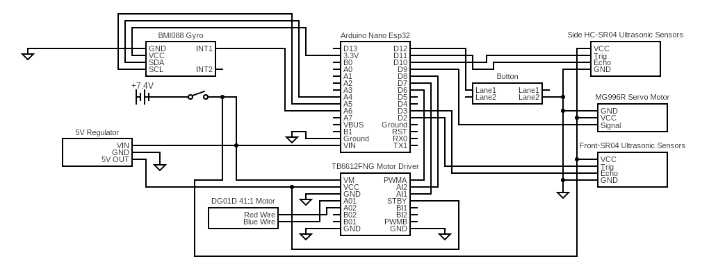

<center><h1> Nerdvana Pegasus 2023 </center>

## Table of Contents
* [Photos](#team-image)
  * [Team](#team-image)
  * [Robot](#robot-image)
* [Performance Video](#video)
* [Mobility Management](#mobility-management)
  * [Powertrain](#powertrain-mechanical)
    * [Motor](#motor-mechanical)
  * [Steering](#steering-mechanical)
    * [Steering Mechanism](#steering-mechanism)
    * [Steering Motor](#steering-motor)
* [Power and Sense Management](#power-and-sense-management)
  * [Battery](#mindstorm-battery)
  * [Inventor Hub](#inventor-hub)
  * [Distance Sensor](#distance-sensor)
  * [IMU](#imu-sensor)
  * [Pixycam 2.1](#pixy-cam-2.1)
  * [Circuit Diagram](#circuit-diagram)
* [Code for each component](#code-for-each-component)
  * [Drive Motor](#drive-motor-code)
  * [Servo Motor](#servo-motor-code)
  * [Camera](#camera-code)
  * [LIDAR](#lidar-code)
    * [Python Data Visualization](#python-data-visualization)
  * [IMU](#gyro-sensor-code)
  * [SD Card](#sd-card-code)
* [Obstacle Management](#obstacle-management)
  * [Qualification Round](#quali-management)
  * [Final Round](#final-management)
* [Randomizer](#randomizer)
* [Resources](#resources)
  * [Images](#images-resources)

### Team: Catana Radu Nicolae si Coman Andrei<a class="anchor" id="team-image"></a>

## Photos of our robot <b>TBD<b> <a class="anchor" id="robot-image"></a>

|  |  | 
| :--: | :--: | 
| *Front* | *Back* |
|  |  | 
| *Left* | *Right* |
|  |  | 
| *Top* | *Bottom* |

<br>

# Mobility Management <a class="anchor" id="mobility-management"></a>

## PowerTrain <a class="anchor" id="powertrain-mechanical"></a>


### Motor <a class="anchor" id="motor-mechanical"></a>

Following an evaluation of different motors, we settled on a LEGO Tehnic Medium Angular Motor that on which we attached a gear. This motor was chosen for its lower-load, fast-response applications, so we can make evaluations faster. Also, it's a simple form factor for building because it can be easily connected to other components.

**Specifications:**
- Voltage: 5V-9V
- Speed: 135RPM ± 15%
- Torque: 3.5 ± Ncm
- Weight: 54g


Where to buy the drive motor: https://raisingrobots.com/product/lego-technic-medium-angular-motor/

As I mentioned, a gear connected to the motor drives a series of gears located at the base of the robot. When the gears are properly aligned, this setup ensures that both wheels rotate in the same direction. Below is the explaination of the rack:


## Steering <a class="anchor" id="steering-mechanical"></a>

### Steering Mechanism <a class="anchor" id="steering-mechanism"></a>

We reviewed several steering systems and decided that this one would be the best optimized for our circuit. This system is designed as a parallelogram, making it simple and easy to handle, allowing for smooth turns at a satisfactory angle.

### Steering Motor <a class="anchor" id="steering-motor"></a>

For steering, we selected the LEGO Tehnic Small Angular Motor, favoring it for its high torque and swift response.

**Specifications:**
- Voltage: 3.3V-6V
- Speed: 85RPM ± 15%
- Torque: 1.8 ± Ncm
- Weight: 32g
- Rotation Angle: 360 degrees


Where to buy the steering motor: https://raisingrobots.com/product/lego-technic-small-angular-motor/

To connect the Spike motor to the steering system, we used a bar of lego.

# Power and Sense Management <a class="anchor" id="power-and-sense-management"></a>

### Recharchable Mindstorm Battery <a class="anchor" id="mindstorm-battery"></a>

We chose this battery because of the Inventor Hub, which is a key component of our robot. This battery is the same type used in the Spike system, which is why its specifications are only available under the Spike model. It has a capacity of 7.3V and 2100mAh, with a weight of 110g. We selected it to make the robot lighter and to take advantage of its quick charging capability.


Where to buy the battery: https://rebrickable.com/parts/67704/battery-pack-rechargeable-mindstorms-robot-inventor/3/

### Inventor Hub <a class="anchor" id="inventor-hub"></a>

This component is crucial for our robot because it allows us to use the hub's gyroscope to maintain a straighter path. We've implemented PID control on the Gyro to minimize errors in the wall-following system, thereby reducing the chances of the robot touching the track walls.Additionally, all the motors and sensors are connected to it, giving us complete control over every component. We also used the button lights for debugging to indicate whether we're using PID on the Gyro or on the two walls between which the robot is positioned.


Where to buy the Inventor Hub: https://rebrickable.com/parts/67718/hub-programmable-mindstorms-robot-inventor/#buy_parts

### Distance Sensor <a class="anchor" id="distance-sensor"></a>

We used distance sensors for their precision when the robot is positioned between two walls, allowing us to adjust it to stay exactly in the center of the corridor. This is beneficial in both challenges, as the front camera will remain centered, enabling it to detect blocks more quickly and easily.


Where to buy the LEGO Tehnic Distance Sensor: https://education.lego.com/en-us/products/lego-technic-distance-sensor/45604/

### Circuit diagram <a class="anchor" id="circuit-diagram"></a>


<br>

# Code for each component <a class="anchor" id="code-for-each-component"></a>

## Drive Motor <a class="anchor" id="drive-motor-code"></a>

The motor driver can be directly managed with a single PWM pin that adjusts the motor's speed and two digital pins designated for determining the motor's rotation direction. Consequently, the use of any external library for motor manipulation was unnecessary.

We devised two functions within our control system: one to modify the motor's velocity and another to halt it effectively, incorporating a braking feature. To achieve this, we convert the desired speed from our established scale of -100 to +100 to the PWM equivalent of 0 to 255. The motor's direction is then adjusted according to the sign of the input value.

```ino
void motor_start(int speed) {
  speed = -speed;  
  int out = abs(speed) * 2.55; // Convert speed to PWM value (0 to 255)
  if(speed >= 0) { // Forward direction
    digitalWrite(AIN1, HIGH);
    digitalWrite(AIN2, LOW);
  }
  else { // Reverse direction
    digitalWrite(AIN1, LOW);
    digitalWrite(AIN2, HIGH);
  }
  analogWrite(PWM1, out);

  Serial << "speed: " << speed << "\n";
}

void motor_stop() {
  motor_start(-10); 
}
```

However, for the encoder, we required a specialized library to handle the more complex signal processing. The library we use for interfacing with the encoder is called *Encoder.h*.

The encoder operates with a straightforward function that we found easy to comprehend and program. The constant with which we multiply the encoder's output value was determined empirically through multiple tests with varying distances. This calibration process allowed us to accurately convert the encoder's readings into centimeters.

```ino
long read_motor_encoder() {
  return (0.01285) * (double)myEnc.read();
}
```

## Servo Motor <a class="anchor" id="servo-motor-code"></a>

For controlling the servo motor, we utilize the *Servo.h* library, which provides the necessary functions to manage the servo's movements. Initially, we configure the servo by establishing its range, defining the maximum and minimum angles it can achieve in both directions. This ensures that we can accurately position the servo within its operational limits.

```ino
// Servo
void servo_setup() {
  servo.attach(SERVO_PIN, 1400, 1611);
  move_servo(0);
  delay(50);
}
```

The gyro sensor's measurement of the robot's rotation angle is essential for precise spatial positioning. This angle adjusts the lidar data to reflect true distances, accounting for changes in position and orientation. Neglecting this leads to mapping inaccuracies, hence, rotation compensation is critical for precise navigation.


## IMU <a class="anchor" id="gyro-sensor-code"></a>

To utilize the gyro sensor, we needed to include the _BMI088.h_ library. During initialization, we allocate a 10-second window to measure the sensor's drift, allowing us to refine the robot's angular readings for greater precision. Additionally, we configure the sensor's output data rate to 400Hz and set the bandwidth to 47Hz. The bandwidth determines the frequency of data sampling by the sensor; a higher bandwidth yields more precise data at the cost of increased power consumption. We also designate pin 15 as an input and attach an interrupt to it, enabling us to capture data from the sensor as soon as it becomes available.

```ino
void gyro_setup(bool debug) {
  int status = accel.begin();
  status = accel.setOdr(Bmi088Accel::ODR_200HZ_BW_80HZ);
  status = accel.pinModeInt1(Bmi088Accel::PUSH_PULL,Bmi088Accel::ACTIVE_HIGH);
  status = accel.mapDrdyInt1(true);


  status = gyro.begin();

  status = gyro.setOdr(Bmi088Gyro::ODR_400HZ_BW_47HZ);
  status = gyro.pinModeInt3(Bmi088Gyro::PUSH_PULL,Bmi088Gyro::ACTIVE_HIGH);
  status = gyro.mapDrdyInt3(true);

  pinMode(15,INPUT);
  attachInterrupt(15,gyro_drdy,RISING);  


  if(status < 0) {
    if(debug) Serial << "BMI Initialization Error!  error: " << status << "\n";
    //init_error = init_gyro_error = true;
  }
  else  {
    // Gyro drift calculation
    if(debug) Serial.println("Starting gyro drift calculation...");

    gx = 0;
    gy = 0;
    gz = 0;

    gyro_last_read_time = millis();

    double start_time = millis();
    while(millis() - start_time < DRIFT_TEST_TIME * 1000) {
      gyro.readSensor();  
      double read_time = millis();
      gx += (gyro.getGyroX_rads() * (read_time - gyro_last_read_time) * 0.001);
      // gy += (bmi.getGyroY_rads() * (read_time - gyro_last_read_time) * 0.001);
      // gz += (bmi.getGyroZ_rads() * (read_time - gyro_last_read_time) * 0.001);

      gyro_last_read_time = read_time;
    }

    drifts_x = gx / DRIFT_TEST_TIME;
    // drifts_y = gy / DRIFT_TEST_TIME;
    // drifts_z = gz / DRIFT_TEST_TIME;

    if(debug) Serial.print("Drift test done!\nx: ");
    if(debug) Serial.print(drifts_x, 6);
    if(debug) Serial.print("   y: ");
    if(debug) Serial.print(drifts_y, 6);
    if(debug) Serial.print("   z: ");
    if(debug) Serial.println(drifts_z, 6);
  }
  // Gyro value reset
  gx = 0;
  gy = 0;
  gz = 0;

  gyro_last_read_time = millis();
}
```

Within the *read_gyro* function, we're retrieving data from the gyro sensor and adjusting it to account for any detected drift, enhancing the accuracy of the readings. Since the gyro provides data in radians, a conversion to degrees is necessary for our application. We're focusing solely on the rotation around the x-axis, hence we only compute the *gx* value, which represents the robot's angular rotation in degrees on that specific axis.

```ino
void read_gyro(bool debug) {
  //delta_start = millis();
  if(gyro_flag) {
    gyro_flag = false;
    cnt1++;
    gyro.readSensor();   
    double read_time = millis();

    gx += ((gyro.getGyroX_rads() - drifts_x) * (read_time - gyro_last_read_time) * 0.001) * 180.0 / PI;
    //gy -= ((bmi.getGyroY_rads() - drifts_y) * (read_time - gyro_last_read_time) * 0.001) * 180.0 / PI;
    //gz -= ((bmi.getGyroZ_rads() - drifts_z) * (read_time - gyro_last_read_time) * 0.001) * 180.0 / PI;

    gyro_last_read_time = read_time;

    //delta_gyro = millis() - delta_start;
    if(debug) Serial << "Gyro: gx: " << gx << "    gy: " << gy << "    gz: " << gz << "\n";

    if(debug) {
      Serial.print("Gyro: gx: ");
      Serial.print(gx);
      Serial.print(" gy: ");
      Serial.print(gy);
      Serial.print(" gz: ");
      Serial.println(gz);
    }
  }
}
```

# Obstacle Management <a class="anchor" id="obstacle-management"></a>

## Qualification Round <a class="anchor" id="quali-management"></a>

void loop()
{
  distanceFront = distminFront+10;
  timer = millis();
  if(turns==0)
    checkMs = 3000;
  else
    checkMs = 5000;
  //distanceDR = getDistance(trigDR, echoDR);
  //distanceDR = sonarDR.ping_cm();
  //delay(100);
  while(distanceFront > distminFront || distanceFront<=10)
  {
    read_gyro(false);
    //delay(100);
    if(gz>=currMiddleZ)
    {
      error = gz-currMiddleZ;
      degServo = MiddleServoDeg-error;
    }
    else if(gz<currMiddleZ)
    {
      error = currMiddleZ-gz;
      degServo = MiddleServoDeg+error;
    }
    Serial.print(degServo);
    Serial.print("  ");
    Serial.print(distanceDR);
    Serial.print("  ");
    Serial.println(distanceFront);
    if(degServo>HighServoLimit)
      degServo=HighServoLimit;
    if(degServo<LowServoLimit)
      degServo=LowServoLimit;
    servo.write(degServo);
    moveForward(500);

    if(millis()-timer>checkMs)
    {
      if(currMiddleZ-5<=gz && gz<=currMiddleZ+5)
      {
        streak++;
        if(streak==maxstreak)
        {
          //distanceFront = getDistance(trigFront, echoFront);
          distanceFront = sonarFR.ping_cm();
          //delay(100);
          streak = 0;
        }
        else
          distanceFront = distminFront+10;
      }
      else
        streak = 0;
    }
    //distanceDR = getDistance(trigDR, echoDR);
    //distanceDR = sonarDR.ping_cm();
    //delay(100);
  }
  stopMotor();

## Final Round <a class="anchor" id="final-management"></a>

For the final round resolution, we adopted a three-tiered modular approach to achieve greater precision and fluidity. The first module is designed for navigating through the current section, the second for detecting and evading any immediate cubes, and the third for executing rotations and setting up for the following section.

The initial segment serves as the core switch-case structure within our code, where we continuously monitor for any cubes to avoid or for cues to initiate a rotation in preparation for the upcoming section. Should neither of these conditions arise, the robot is programmed to maintain a direct trajectory through the segment, ensuring uninterrupted progress.

```ino
case SECTION: {
  if(turn_ok && wall_dist[FRONT] && wall_dist[FRONT] < 700  && millis() - last_rotate > rotate_timeout) {
    turns++;
    last_rotate = millis();
    last_cube_color = 0;
    last_dist_to_cube = 0;
    flag = 0;
    cube_section_cnt = 0;
    if (wall_dist[side_wall] > 550)
      CASE = ROTATE;
    else
      current_angle += direction * 90;   
  } else if (last_dist_to_cube && cube_color != last_cube_color && cube_color != 0 && wall_dist[BACK] < 1800) {
    move_servo(cube_color * 1);

    if (cube_color == GREEN) {
      if(direction == 1)
        goal_distance = 250 + (wall_dist[side_wall] - 230) / 6;
      else
        goal_distance = 850 - (1000 - wall_dist[side_wall]) / 6;
    } else {
      if(direction == 1)
        goal_distance = 770 - (1000 - wall_dist[side_wall]) / 5;
      else
        goal_distance = 270 + (wall_dist[side_wall] - 200) / 5;
    }

    last_cube_color = cube_color;
    cube_section_cnt++;

    if(turns == 3) {
      final_cube_color = last_cube_color;
      final_cube_pos = cube_section_cnt;
      final_cube_turn = turns;
    } 
    if(turns == 4) {
      if(last_cube_y < 1700) {
        final_cube_color = last_cube_color;
        final_cube_pos = cube_section_cnt;
        final_cube_turn = turns;
      }
    }
    
    CASE = AVOID_CUBE;
  } else {

    if(millis() - last_turn_ok > rotate_timeout && (wall_dist[BACK] > 1850 || (wall_dist[LEFT] + wall_dist[RIGHT]) > 1200) && !turn_ok) {
      turn_ok = 1;
      last_turn_ok = millis();
    }
    pid_error_gyro = ((current_angle) - gx) * kp_gyro + (pid_error_gyro - pid_last_error_gyro) * kd_gyro;
    pid_last_error_gyro = pid_error_gyro;

    move_servo(pid_error_gyro);
  }
  break;
}
```

# Randomizer <a class="anchor" id="randomizer"></a>

To ensure the robot's ability to adapt to any course, we developed a randomizer that generates a random sequence of colors and positions for the cubes. You can find this web application at the following link: https://nerdvana.ro/wro-fe/

<br>

# Resources <a class="anchor" id="resources"></a>

## Images <a class="anchor" id="images-resources"></a>
<li> LEGO Tehnic Medium Angular Motor - https://img.bricklink.com/ItemImage/PN/86/54696c01.png
<li> LEGO Tehnic Small Angular Motor - https://i.sstatic.net/th7N7.png
<li> Recharchable Battery - https://cdn.rebrickable.com/media/thumbs/parts/elements/6299315.jpg/250x250p.jpg
<li> Inventor Hub - https://cdn.rebrickable.com/media/thumbs/parts/ldraw/3/67718.png/250x250p.png
<li> Distance Sensor - https://cdn.toypro.com/media/cache/tp_product_detail/uploads/images/custom/43694-src.webp
<li> Pixycam 2.1 - https://pixycam.com/wp-content/uploads/2021/05/pixy2_3_result.jpg
<li> LiPo Battery - https://www.autorc.ro/16064-large_default/acumulator-lipo-gens-ace-3s-111v-2200mah-20c-mufa-xt60.jpg
<li> Grove BMI088 Gyroscope - https://files.seeedstudio.com/wiki/Grove-6-Axis_Accelerometer-Gyroscope-BMI088/img/main.jpg
<li> Linear voltage regulator - https://ro.farnell.com/productimages/standard/en_GB/GE3TO220-40.jpg


<br>

## Copyright <a class="anchor" id="copyright"></a>

Unless explicitly stated otherwise, all rights, including copyright, in the content of these files and images are owned or controlled for these purposes by Nerdvana Romania.

You may copy, download, store (in any medium), adapt, or modify the content of these Nerdvana Romania resources, provided that you properly attribute the work to Nerdvana Romania.

For any other use of Nerdvana Romania's content, please get in touch with us at office@nerdvana.ro.

© 2023 Nerdvana Romania. All rights reserved.
