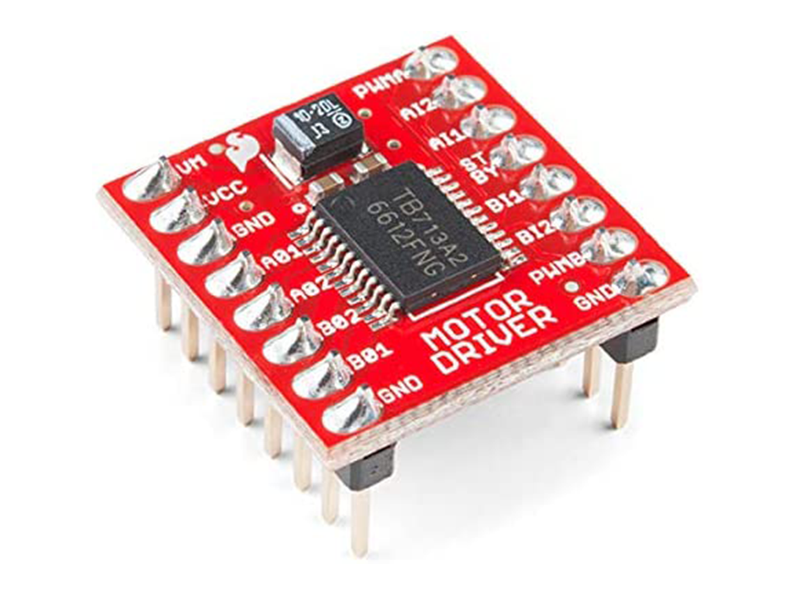

<center><h1> Nerdvana Pegasus 2023 </center>

## Table of Contents
* [Photos](#team-image)
  * [Team](#team-image)
  * [Robot](#robot-image)
* [Performance Video](#video)
* [Mobility Management](#mobility-management)
  * [Powertrain](#powertrain-mechanical)
    * [Drivetrain](#drivetrain-mechanical)
    * [Motor](#motor-mechanical)
    * [Motor Driver](#motor-driver-mechanical)
  * [Steering](#steering-mechanical)
    * [Servo Motor](#servo-motor)
  * [Chassis](#chassis-mechanical)
* [Power and Sense Management](#power-and-sense-management)
  * [Li-Po Battery](#li-po-battery)
  * [Teensy 4.1](#teensy-4.1)
  * [LIDAR](#lidar-sensor)
  * [IMU](#imu-sensor)
  * [Pixycam 2.1](#pixy-cam-2.1)
  * [Voltage Regulator](#voltage-regulator-(L7805CV))
  * [Circuit Diagram](#circuit-diagram)
* [Code for each component](#code-for-each-component)
  * [Drive Motor](#drive-motor-code)
  * [Servo Motor](#servo-motor-code)
  * [Camera](#camera-code)
  * [LIDAR](#lidar-code)
    * [Python Data Visualization](#python-data-visualization)
  * [IMU](#gyro-sensor-code)
  * [SD Card](#sd-card-code)
* [Obstacle Management](#obstacle-management)
  * [Qualification Round](#quali-management)
  * [Final Round](#final-management)
* [Randomizer](#randomizer)
* [Resources](#resources)
  * [3D Models](#3d-models-resources)
  * [Images](#images-resources)

### Team: Catana Radu Nicolae si Daja Mihai Bogdan<a class="anchor" id="team-image"></a>

# Mobility Management <a class="anchor" id="mobility-management"></a>


## Powertrain <a class="anchor" id="powertrain-mechanical"></a>


### Drivetrain <a class="anchor" id="drivetrain-mechanical"></a>

After reflecting on our experience from last year's competition, where we utilized a rear-wheel drive (RWD) with a differential, we opted for an all-wheel drive (AWD) system for this year's national event. We were motivated to switch because the RWD struggled with steering due to the lack of power in the front wheels. Moreover, an AWD system ensures a more even distribution of power.

However, after deciding to incorporate a LIDAR sensor, we found it essential to mount the sensor low to improve its accuracy. Given its considerable size, and the space constraints for the front differential and driveshaft—further challenged by our decision to place the servo lower to make room for the LIDAR—we ultimately returned to the RWD configuration.

To minimize friction and thereby reduce speed loss, we avoided using 3D-printed components for the moving parts in the drivetrain. Instead, we utilized Lego pieces, which are molded with high precision and therefore have a very low friction coefficient. The 3D-printed parts were reserved for the chassis and for mounting the electronic components onto the Lego structure.

### Motor <a class="anchor" id="motor-mechanical"></a>

Following an evaluation of different motors, we settled on a geared DC motor that comes with a magnetic encoder. This motor was selected for its lightweight and compact design, which stands out among others with comparable output. Additionally, the magnetic encoder offers greater precision than its optical counterpart. We secured the motor to the chassis using screws.

**Specifications:**
- Voltage: < 7V
- Gear Ratio: 1:20
- Speed: 400 ± 13% rpm
- Torque: 0.4 ± kg·cm
- Weight: 67.4g

Where to buy the motor: https://www.adafruit.com/product/4416

To connect the motor's axle to a Lego-compatible axle, we created a custom 3D-printed adapter.


### Motor Driver <a class="anchor" id="motor-driver-mechanical"></a>


To control the speed of the drive motor, we utilized a SparkFun Dual TB6612FNG motor driver.

Where to buy the motor driver: https://www.sparkfun.com/products/14450

## Steering <a class="anchor" id="steering-mechanical"></a>


After experimenting with various steering mechanisms such as Ackermann steering and bell-crank steering, we assessed their advantages and drawbacks. Ultimately, we chose a straightforward steering system consisting of a parallelogram linkage. This decision was made because the alternative systems were either too large or too complex to implement effectively. Our selected mechanism is simple, light, and compact, providing a satisfactory steering angle. While it does not adhere to the Ackermann steering geometry, our tests showed that for our robot's small size and light weight, this omission was not critically significant.

### Servo Motor <a class="anchor" id="servo-motor"></a>


For steering, we selected the MG996R servo motor, favoring it for its high torque and swift response.

**Specifications:**
- Weight: 55g
- Stall torque: 9.4 kg/cm (4.8v)
- Operating speed: 0.17 s/60 degree (4.8v)
- Rotation angle: 180 degree

Where to buy the servo motor: https://www.sigmanortec.ro/servomotor-mg996r-180-13kg

To connect the servo motor to the steering system, we fashioned a custom 3D-printed adapter. Given the dynamic geometry of the system, the connector couldn't be a single rigid piece because its length needed to be adjustable according to the wheel positions. Thus, we designed a two-part beam: the larger piece attaches to the servo and the smaller piece to the steering mechanism. The smaller piece slides into the larger one, permitting the beam's length to vary. We introduced a slight space between the two components to ensure smooth movement, while also ensuring that a significant portion of the smaller piece remains within the larger one to avoid disconnection or bending.


# Power and Sense Management <a class="anchor" id="power-and-sense-management"></a>

### Li-Po Battery <a class="anchor" id="li-po-battery"></a>


Last year, we powered our robot with a 6-pack of AA Nickel-Metal Hydride (NiMH) batteries, which provided approximately 7.2V and 2000mAh but weighed around 650g. With our goal of building a smaller and lighter robot, we recognized the need for a different power source. We chose a Lithium Polymer (Li-Po) battery for its lighter weight, more compact size, and quicker charging capabilities. The specific model we selected is the *LiPo GENS ACE Soaring* (7.4V, 2200mAh, 20C). Switching to this battery reduced the weight of our power pack from 650g to 100g, almost halving the robot's weight. Moreover, the battery is more than twice as small in terms of volume.

Where to buy the battery: https://www.sierra.ro/Acumulator-LiPo-GENS-ACE-Soaring-7-4-V--2200-mA--20C-p11141p.html


### Voltage regulator <a class="anchor" id="voltage-regulator"></a>
")

To provide the Teensy 4.1 with the required 5V, we needed to decrease the output from the 7.4V battery, which can reach up to 8.4V when fully charged. We employed a linear voltage regulator, the L7805CV, capable of converting input voltages below 35V down to a steady 5V.

For the drive motor, which we want to operate at higher speeds, we use a separate voltage regulator, the L7806CV, to step down the battery's 7.4V to 6V. This approach allows us to extract more speed from the motor while maintaining consistent performance across different battery charge levels.

Where to buy the 5V voltage regulator: https://ro.mouser.com/ProductDetail/STMicroelectronics/L7805CV?qs=9NrABl3fj%2FqplZAHiYUxWg%3D%3D

Where to buy the 6V voltage regulator: https://ro.mouser.com/ProductDetail/STMicroelectronics/L7806CV?qs=K4DpzJ20gDEC%252BHE13eVUwg%3D%3D

### Circuit diagram <a class="anchor" id="circuit-diagram"></a>


<br>

# Code for each component <a class="anchor" id="code-for-each-component"></a>

## Drive Motor <a class="anchor" id="drive-motor-code"></a>

The motor driver can be directly managed with a single PWM pin that adjusts the motor's speed and two digital pins designated for determining the motor's rotation direction. Consequently, the use of any external library for motor manipulation was unnecessary.

We devised two functions within our control system: one to modify the motor's velocity and another to halt it effectively, incorporating a braking feature. To achieve this, we convert the desired speed from our established scale of -100 to +100 to the PWM equivalent of 0 to 255. The motor's direction is then adjusted according to the sign of the input value.

```ino
void motor_start(int speed) {
  speed = -speed;  
  int out = abs(speed) * 2.55; // Convert speed to PWM value (0 to 255)
  if(speed >= 0) { // Forward direction
    digitalWrite(AIN1, HIGH);
    digitalWrite(AIN2, LOW);
  }
  else { // Reverse direction
    digitalWrite(AIN1, LOW);
    digitalWrite(AIN2, HIGH);
  }
  analogWrite(PWM1, out);

  Serial << "speed: " << speed << "\n";
}

void motor_stop() {
  motor_start(-10); 
}
```

However, for the encoder, we required a specialized library to handle the more complex signal processing. The library we use for interfacing with the encoder is called *Encoder.h*.

The encoder operates with a straightforward function that we found easy to comprehend and program. The constant with which we multiply the encoder's output value was determined empirically through multiple tests with varying distances. This calibration process allowed us to accurately convert the encoder's readings into centimeters.

```ino
long read_motor_encoder() {
  return (0.01285) * (double)myEnc.read();
}
```

## Servo Motor <a class="anchor" id="servo-motor-code"></a>

For controlling the servo motor, we utilize the *Servo.h* library, which provides the necessary functions to manage the servo's movements. Initially, we configure the servo by establishing its range, defining the maximum and minimum angles it can achieve in both directions. This ensures that we can accurately position the servo within its operational limits.

```ino
// Servo
void servo_setup() {
  servo.attach(SERVO_PIN, 1400, 1611);
  move_servo(0);
  delay(50);
}
```

The gyro sensor's measurement of the robot's rotation angle is essential for precise spatial positioning. This angle adjusts the lidar data to reflect true distances, accounting for changes in position and orientation. Neglecting this leads to mapping inaccuracies, hence, rotation compensation is critical for precise navigation.


## IMU <a class="anchor" id="gyro-sensor-code"></a>

To utilize the gyro sensor, we needed to include the _BMI088.h_ library. During initialization, we allocate a 10-second window to measure the sensor's drift, allowing us to refine the robot's angular readings for greater precision. Additionally, we configure the sensor's output data rate to 400Hz and set the bandwidth to 47Hz. The bandwidth determines the frequency of data sampling by the sensor; a higher bandwidth yields more precise data at the cost of increased power consumption. We also designate pin 15 as an input and attach an interrupt to it, enabling us to capture data from the sensor as soon as it becomes available.

```ino
void gyro_setup(bool debug) {
  int status = accel.begin();
  status = accel.setOdr(Bmi088Accel::ODR_200HZ_BW_80HZ);
  status = accel.pinModeInt1(Bmi088Accel::PUSH_PULL,Bmi088Accel::ACTIVE_HIGH);
  status = accel.mapDrdyInt1(true);


  status = gyro.begin();

  status = gyro.setOdr(Bmi088Gyro::ODR_400HZ_BW_47HZ);
  status = gyro.pinModeInt3(Bmi088Gyro::PUSH_PULL,Bmi088Gyro::ACTIVE_HIGH);
  status = gyro.mapDrdyInt3(true);

  pinMode(15,INPUT);
  attachInterrupt(15,gyro_drdy,RISING);  


  if(status < 0) {
    if(debug) Serial << "BMI Initialization Error!  error: " << status << "\n";
    //init_error = init_gyro_error = true;
  }
  else  {
    // Gyro drift calculation
    if(debug) Serial.println("Starting gyro drift calculation...");

    gx = 0;
    gy = 0;
    gz = 0;

    gyro_last_read_time = millis();

    double start_time = millis();
    while(millis() - start_time < DRIFT_TEST_TIME * 1000) {
      gyro.readSensor();  
      double read_time = millis();
      gx += (gyro.getGyroX_rads() * (read_time - gyro_last_read_time) * 0.001);
      // gy += (bmi.getGyroY_rads() * (read_time - gyro_last_read_time) * 0.001);
      // gz += (bmi.getGyroZ_rads() * (read_time - gyro_last_read_time) * 0.001);

      gyro_last_read_time = read_time;
    }

    drifts_x = gx / DRIFT_TEST_TIME;
    // drifts_y = gy / DRIFT_TEST_TIME;
    // drifts_z = gz / DRIFT_TEST_TIME;

    if(debug) Serial.print("Drift test done!\nx: ");
    if(debug) Serial.print(drifts_x, 6);
    if(debug) Serial.print("   y: ");
    if(debug) Serial.print(drifts_y, 6);
    if(debug) Serial.print("   z: ");
    if(debug) Serial.println(drifts_z, 6);
  }
  // Gyro value reset
  gx = 0;
  gy = 0;
  gz = 0;

  gyro_last_read_time = millis();
}
```

Within the *read_gyro* function, we're retrieving data from the gyro sensor and adjusting it to account for any detected drift, enhancing the accuracy of the readings. Since the gyro provides data in radians, a conversion to degrees is necessary for our application. We're focusing solely on the rotation around the x-axis, hence we only compute the *gx* value, which represents the robot's angular rotation in degrees on that specific axis.

```ino
void read_gyro(bool debug) {
  //delta_start = millis();
  if(gyro_flag) {
    gyro_flag = false;
    cnt1++;
    gyro.readSensor();   
    double read_time = millis();

    gx += ((gyro.getGyroX_rads() - drifts_x) * (read_time - gyro_last_read_time) * 0.001) * 180.0 / PI;
    //gy -= ((bmi.getGyroY_rads() - drifts_y) * (read_time - gyro_last_read_time) * 0.001) * 180.0 / PI;
    //gz -= ((bmi.getGyroZ_rads() - drifts_z) * (read_time - gyro_last_read_time) * 0.001) * 180.0 / PI;

    gyro_last_read_time = read_time;

    //delta_gyro = millis() - delta_start;
    if(debug) Serial << "Gyro: gx: " << gx << "    gy: " << gy << "    gz: " << gz << "\n";

    if(debug) {
      Serial.print("Gyro: gx: ");
      Serial.print(gx);
      Serial.print(" gy: ");
      Serial.print(gy);
      Serial.print(" gz: ");
      Serial.println(gz);
    }
  }
}
```

# Obstacle Management <a class="anchor" id="obstacle-management"></a>

## Qualification Round <a class="anchor" id="quali-management"></a>

void loop()
{
  distanceFront = distminFront+10;
  timer = millis();
  if(turns==0)
    checkMs = 3000;
  else
    checkMs = 5000;
  //distanceDR = getDistance(trigDR, echoDR);
  //distanceDR = sonarDR.ping_cm();
  //delay(100);
  while(distanceFront > distminFront || distanceFront<=10)
  {
    read_gyro(false);
    //delay(100);
    if(gz>=currMiddleZ)
    {
      error = gz-currMiddleZ;
      degServo = MiddleServoDeg-error;
    }
    else if(gz<currMiddleZ)
    {
      error = currMiddleZ-gz;
      degServo = MiddleServoDeg+error;
    }
    Serial.print(degServo);
    Serial.print("  ");
    Serial.print(distanceDR);
    Serial.print("  ");
    Serial.println(distanceFront);
    if(degServo>HighServoLimit)
      degServo=HighServoLimit;
    if(degServo<LowServoLimit)
      degServo=LowServoLimit;
    servo.write(degServo);
    moveForward(500);

    if(millis()-timer>checkMs)
    {
      if(currMiddleZ-5<=gz && gz<=currMiddleZ+5)
      {
        streak++;
        if(streak==maxstreak)
        {
          //distanceFront = getDistance(trigFront, echoFront);
          distanceFront = sonarFR.ping_cm();
          //delay(100);
          streak = 0;
        }
        else
          distanceFront = distminFront+10;
      }
      else
        streak = 0;
    }
    //distanceDR = getDistance(trigDR, echoDR);
    //distanceDR = sonarDR.ping_cm();
    //delay(100);
  }
  stopMotor();

## Final Round <a class="anchor" id="final-management"></a>

For the final round resolution, we adopted a three-tiered modular approach to achieve greater precision and fluidity. The first module is designed for navigating through the current section, the second for detecting and evading any immediate cubes, and the third for executing rotations and setting up for the following section.

The initial segment serves as the core switch-case structure within our code, where we continuously monitor for any cubes to avoid or for cues to initiate a rotation in preparation for the upcoming section. Should neither of these conditions arise, the robot is programmed to maintain a direct trajectory through the segment, ensuring uninterrupted progress.

```ino
case SECTION: {
  if(turn_ok && wall_dist[FRONT] && wall_dist[FRONT] < 700  && millis() - last_rotate > rotate_timeout) {
    turns++;
    last_rotate = millis();
    last_cube_color = 0;
    last_dist_to_cube = 0;
    flag = 0;
    cube_section_cnt = 0;
    if (wall_dist[side_wall] > 550)
      CASE = ROTATE;
    else
      current_angle += direction * 90;   
  } else if (last_dist_to_cube && cube_color != last_cube_color && cube_color != 0 && wall_dist[BACK] < 1800) {
    move_servo(cube_color * 1);

    if (cube_color == GREEN) {
      if(direction == 1)
        goal_distance = 250 + (wall_dist[side_wall] - 230) / 6;
      else
        goal_distance = 850 - (1000 - wall_dist[side_wall]) / 6;
    } else {
      if(direction == 1)
        goal_distance = 770 - (1000 - wall_dist[side_wall]) / 5;
      else
        goal_distance = 270 + (wall_dist[side_wall] - 200) / 5;
    }

    last_cube_color = cube_color;
    cube_section_cnt++;

    if(turns == 3) {
      final_cube_color = last_cube_color;
      final_cube_pos = cube_section_cnt;
      final_cube_turn = turns;
    } 
    if(turns == 4) {
      if(last_cube_y < 1700) {
        final_cube_color = last_cube_color;
        final_cube_pos = cube_section_cnt;
        final_cube_turn = turns;
      }
    }
    
    CASE = AVOID_CUBE;
  } else {

    if(millis() - last_turn_ok > rotate_timeout && (wall_dist[BACK] > 1850 || (wall_dist[LEFT] + wall_dist[RIGHT]) > 1200) && !turn_ok) {
      turn_ok = 1;
      last_turn_ok = millis();
    }
    pid_error_gyro = ((current_angle) - gx) * kp_gyro + (pid_error_gyro - pid_last_error_gyro) * kd_gyro;
    pid_last_error_gyro = pid_error_gyro;

    move_servo(pid_error_gyro);
  }
  break;
}
```

# Randomizer <a class="anchor" id="randomizer"></a>

To ensure the robot's ability to adapt to any course, we developed a randomizer that generates a random sequence of colors and positions for the cubes. You can find this web application at the following link: https://nerdvana.ro/wro-fe/

<br>

# Resources <a class="anchor" id="resources"></a>

## 3D Models <a class="anchor" id="3d-models-resources"></a>
<li> DC Motor - https://grabcad.com/library/12v-dc-motor-350rpm-w-encoder-from-dfrobot-1
<li> MG996R Servo motor - https://grabcad.com/library/servomotor-mg996r-4
<li> Sparkfun Motor Driver - https://grabcad.com/library/sparkfun-motor-driver-dual-tb6612fng-1a-1
<li> Teensy 4.1 - https://grabcad.com/library/teensy-4-1-2
<li> RPLIDAR A1 - https://grabcad.com/library/rplidar-a1-holder-1
<li> Pixycam 2.1 - https://grabcad.com/library/cmucam-pixy-2-2
<li> LiPo Battery - https://grabcad.com/library/2s-7-4v-li-po-battery-1
<li> Grove BMI088 Gyroscope - https://grabcad.com/library/mpu6050-1
<li> Linear Voltage Regulator - https://grabcad.com/library/linear-voltage-regulators-78xx-1
<li> Prototype Board - https://grabcad.com/library/pcb-board-prototype-3x7cm-1

<br>

## Images <a class="anchor" id="images-resources"></a>
<li> DC Motor - https://www.adafruit.com/product/4416
<li> Sparkfun Motor Driver - https://cdn.sparkfun.com//assets/parts/1/2/4/8/2/14450a-01.jpg
<li> MG996R Servo motor - https://www.digikey.com/htmldatasheets/production/5014637/0/0/1/media/bg1.jpg
<li> Teensy 4.1 - https://circuitpython.org/assets/images/boards/large/teensy41.jpg
<li> RPLIDAR A1 - https://www.waveshare.com/wiki/RPLIDAR_A1
<li> Pixycam 2.1 - https://pixycam.com/wp-content/uploads/2021/05/pixy2_3_result.jpg
<li> LiPo Battery - https://www.autorc.ro/16064-large_default/acumulator-lipo-gens-ace-3s-111v-2200mah-20c-mufa-xt60.jpg
<li> Grove BMI088 Gyroscope - https://files.seeedstudio.com/wiki/Grove-6-Axis_Accelerometer-Gyroscope-BMI088/img/main.jpg
<li> Linear voltage regulator - https://ro.farnell.com/productimages/standard/en_GB/GE3TO220-40.jpg


<br>

## Copyright <a class="anchor" id="copyright"></a>

Unless explicitly stated otherwise, all rights, including copyright, in the content of these files and images are owned or controlled for these purposes by Nerdvana Romania.

You may copy, download, store (in any medium), adapt, or modify the content of these Nerdvana Romania resources, provided that you properly attribute the work to Nerdvana Romania.

For any other use of Nerdvana Romania's content, please get in touch with us at office@nerdvana.ro.

© 2023 Nerdvana Romania. All rights reserved.
